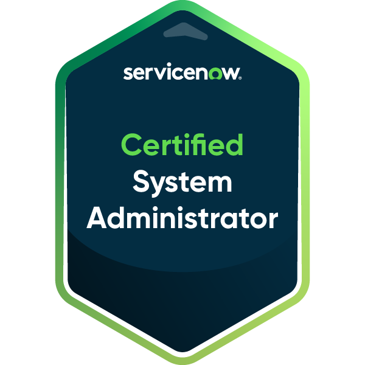
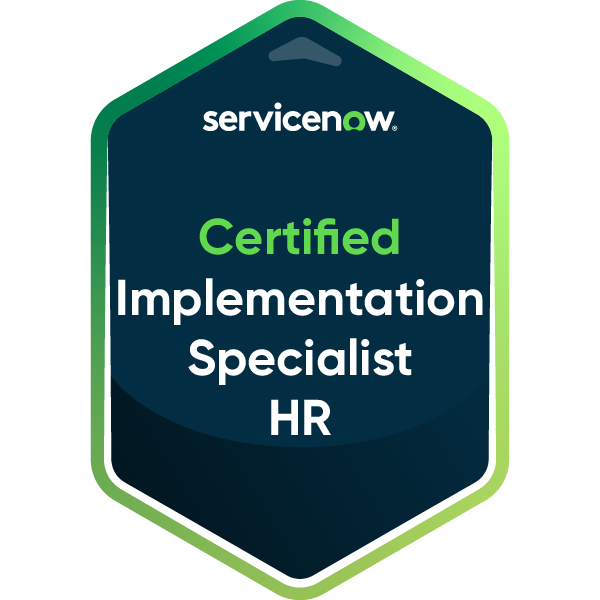
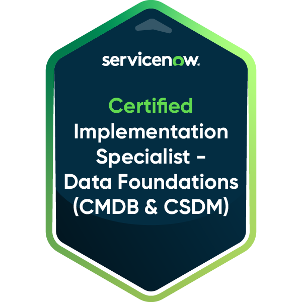
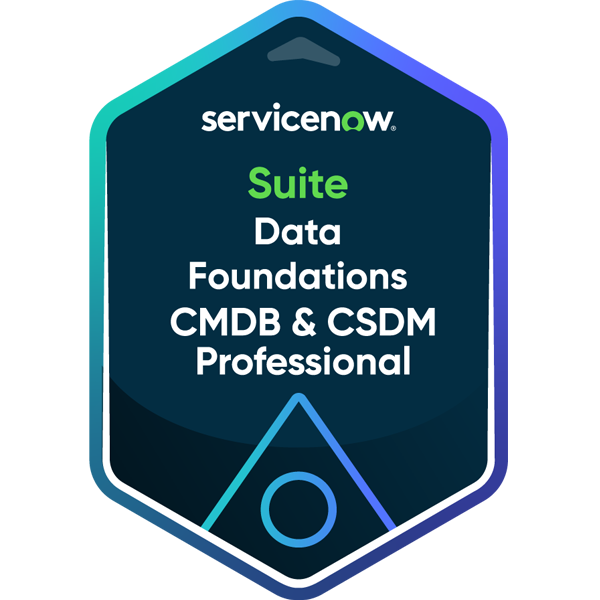

<!--
  Hesler Zacasa Garcia - GitHub Profile README
  Feel free to update the links and details as you continue growing!
-->

  
  
   

  # Hi there, I'm Hesler! 👋
  
  ### Software Engineer 💻 | ServiceNow Consultant 🛠️

  

    
    
    
  

---

### 🚀 About Me

I am a passionate **Software Engineer** and **Technical ServiceNow Consultant** based in Honduras 🇭🇳. I specialize in designing scalable workflow solutions, building modern web applications, and database engineering. 

My professional mission is to streamline enterprise operations and improve business efficiency through process automation and data-driven solutions. I am also expanding my skills in **Business Intelligence and Big Data Analytics** to build smarter, predictive software architectures.

- 🗣️ **Languages:** English (C2 - Proficient), Spanish (Native)
- 🎯 **Goals:** Continuing to master advanced ServiceNow integrations, enterprise system design, and big data visualization.

---

### 🛡️ ServiceNow Credentials & Specializations

As a certified ServiceNow professional, I build, configure, and optimize enterprise-level modules.

  
  
  
  

#### **Areas of Expertise:**
- **Service Portals & Widgets:** Custom UI/UX Portal design and widget creation.
- **Automation & Logic:** Flow Designer, Integration Hub, ServiceNow scripting.
- **Quality & Analytics:** Automated Test Framework (ATF), Platform Analytics.
- **Enterprise Settings:** CMDB Configuration, Agile & Test Management.

---

### 🛠️ Tech Stack & Skills

<table>
  <tr>
    <td valign="top" width="50%">
      <h4>💻 Languages & Frameworks</h4>
      
      
      
      
      
      
      
        
      <h4>🎨 Frontend & Creative Tech</h4>
      
      
      
      
      
    </td>
    <td valign="top" width="50%">
      <h4>🛠️ ServiceNow Platform</h4>
      
      
      
      
        
      <h4>📊 Data, BI & Tools</h4>
      
      
      
      
      
    </td>
  </tr>
</table>

---

### 📈 GitHub Statistics

  <table border="0">
    <tr>
      <td align="center">
        
      </td>
      <td align="center">
        
      </td>
    </tr>
    <tr>
      <td align="center" colspan="2">
        
      </td>
    </tr>
  </table>

---

### 🤝 Let's Connect!

- **Email:** [onandyzacasa@hotmail.es](mailto:onandyzacasa@hotmail.es)
- **LinkedIn:** [linkedin.com/in/hesler-zacasa-garcia](https://linkedin.com/in/hesler-zacasa-garcia)
- **Portfolio:** [Hesslero](https://hesslero.vercel.app/)

  Designed with ❤️ by Hesler Zacasa Garcia.

